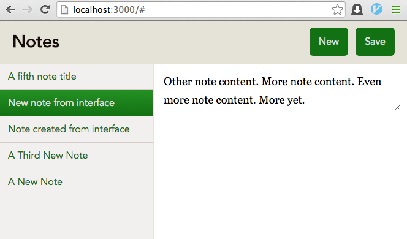

Angular.js Demo: Notes app
==========================

This is a demo application to explain the basics of AngularJS.

It's a basic notes app that allows you to create, view, and update notes.

The `NotesController` provides a CRUD API for notes which is then accessed by an Angular application.

## Running The App

1. Install gems

		$ bundle install --path vendor/bundle

2. Run migrations

		$ bundle exec rake db:migrate

3. Start the Rails server

		$ bundle exec rails server

## License
Licensed under the MIT License. See the included LICENSE file.
